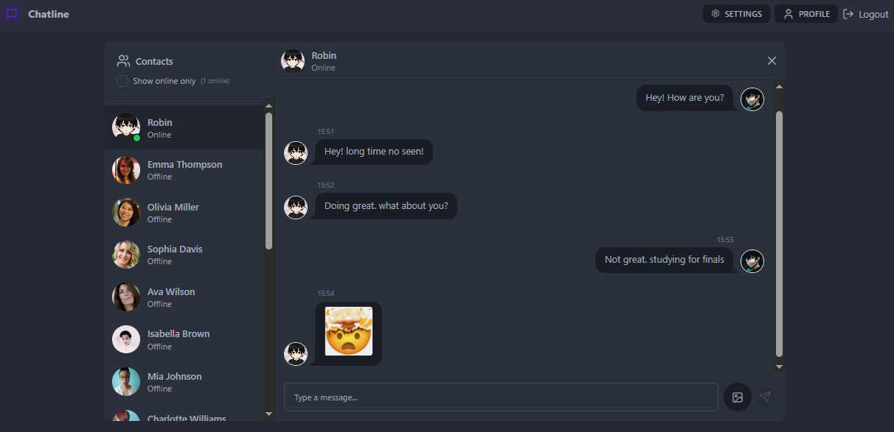

# 💬 Realtime Chat App

A full-stack **Realtime Chat Application** built with the **MERN stack** (MongoDB, Express.js, React.js, Node.js) and **Socket.io** for seamless, real-time messaging. The app features user authentication, real-time communication, and a fully responsive UI optimized for both desktop and mobile devices.

---


## 🔗 Preview

 
--
🌍 Live Demo - https://chat-app-rt-w3n8.onrender.com/

---

## 🚀 Features

- 🔒 JWT-based user authentication  
- 🧠 Global state management using Zustand  
- 💬 Real-time chat updates via Socket.io  
- 🖼️ Cloudinary integration for profile image uploads  
- ☁️ Responsive and mobile-friendly UI with DaisyUI  
- 🔔 Instant notifications with react-hot-toast  
- 🛠️ RESTful API with Express & MongoDB  
- 🔄 Persistent login using cookies  
- 🌐 Modern routing with React Router DOM v7
- 🌙 Light/Dark theme support via DaisyUI themes

---

## 🖥️ Tech Stack

### 🚀 Frontend

- [React.js v19](https://react.dev/)
- [Zustand](https://zustand-demo.pmnd.rs/) – State management
- [DaisyUI](https://daisyui.com/) + [Tailwind CSS](https://tailwindcss.com/) – UI components & styling
- [React Router DOM v7](https://reactrouter.com/)
- [Axios](https://axios-http.com/) – API communication
- [Socket.io-client](https://socket.io/docs/v4/client-api/) – Real-time events
- [Lucide-react](https://www.npmjs.com/package/lucide-react) – Icon library
- [React-hot-toast](https://react-hot-toast.com/) – Notifications

### 🛠 Backend

- [Node.js](https://nodejs.org/) & [Express.js v5](https://expressjs.com/)
- [MongoDB](https://www.mongodb.com/) with [Mongoose](https://mongoosejs.com/)
- [Socket.io v4.8.1](https://socket.io/docs/v4/)
- [JWT](https://jwt.io/) – Authentication
- [Bcrypt.js](https://www.npmjs.com/package/bcryptjs) – Password hashing
- [Cloudinary](https://cloudinary.com/) – Media uploads
- [Cookie-parser](https://www.npmjs.com/package/cookie-parser) – Session handling
- [CORS](https://www.npmjs.com/package/cors) & [dotenv](https://www.npmjs.com/package/dotenv) – Configuration

---


## <a name="getting-started">🚀 Getting Started</a>

To get started follow these steps:

#### Cloning the Repository

Using CLI

```bash
git clone https://github.com/smRid/Real-time-Chat-App.git
```

**\*\*_Ensure you have installed [Git](https://git-scm.com) on your machine._**

or using GitHub:

-   Go to the project [repository](https://github.com/smRid/Real-time-Chat-App) on my GitHub page
-   Click on the green button on the top 👆
-   Click Download ZIP


### ⚙️ Installation


## Setup .env file
```bash
MONGODB_URI=...
PORT=5001
JWT_SECRET=...

CLOUDINARY_CLOUD_NAME=...
CLOUDINARY_API_KEY=...
CLOUDINARY_API_SECRET=...

NODE_ENV=development
```

Install the project dependencies using npm:

### Build the app

```bash
npm run build
```

**\*\*_Ensure you have installed [NodeJS](https://nodejs.org/en) on your machine._**

### Start the app

```bash
npm run start
```

**\*\*_Navigate to http://localhost:5001 in your browser to access the local development server._**
